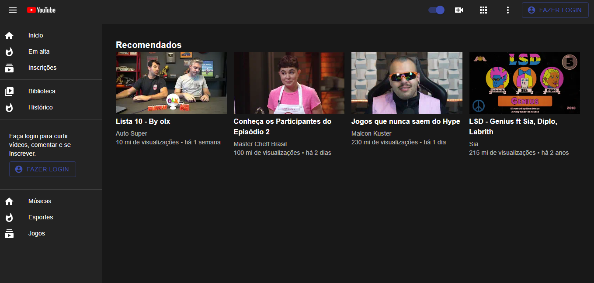

### Clone da Interface do Youtube conforme orientação do vídeo de Lucas Nhimi

 

Nesse clone além de utilizar toda a biblioteca do Material UI, também foi utilizada a técnica de DarkMode.

 

O projeto foi criado com CREATE-REACT-APP, para executa-lo basta entrar no diretório /youtubeclone e rodar:

#### yarn start

ou 

#### npm start

 
 

[Link do Vídeo](https://youtu.be/u9FnmBdBl5k)

[Link do Canal](https://www.youtube.com/c/LucasNhimi/featured)

 

Dark Mode

 

 

Light Mode

 

